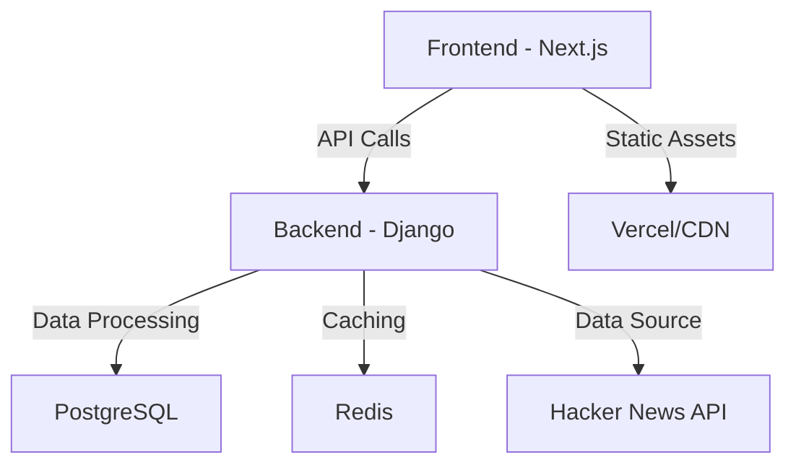

# Hacker News Analytics Dashboard

A comprehensive analytics dashboard for Hacker News data, providing insights and visualizations of trending stories, comments, and user activity.

## 🚀 Setup Instructions

### Prerequisites
- Node.js (v16 or later)
- Python 3.8+
- Docker (optional, for containerized deployment)
- Redis (for caching)
- PostgreSQL (for data storage)

### Backend Setup

1. **Clone the repository**
   ```bash
   git clone https://github.com/mehyar500/hacker-news-api-goodie.git
   cd hacker-news-api-goodie/backend
   ```

2. **Set up Python environment**
   ```bash
   python -m venv venv
   # Activate virtual environment
   # Windows: .\venv\Scripts\activate
   # Unix/MacOS: source venv/bin/activate
   ```

3. **Install dependencies**
   ```bash
   pip install -r requirements.txt
   ```

4. **Configure environment variables**
   ```bash
   cp .env.example .env
   # Edit .env with your configuration
   ```

5. **Run database migrations**
   ```bash
   python manage.py migrate
   ```

6. **Start the backend server**
   ```bash
   python manage.py runserver
   ```
   The API will be available at `http://localhost:8000/v0/`

### Frontend Setup

1. **Navigate to frontend directory**
   ```bash
   cd ../frontend
   ```

2. **Install dependencies**
   ```bash
   npm install
   ```

3. **Configure environment variables**
   ```bash
   cp .env.local.example .env.local
   # Edit .env.local if needed
   ```

4. **Start the development server**
   ```bash
   npm run dev
   ```
   The app will be available at `http://localhost:3000`

## 🏗️ Technical Architecture



### Key Components

1. **Frontend**
   - Built with Next.js for server-side rendering
   - TypeScript for type safety
   - TailwindCSS for styling
   - Redux for state management
   - Recharts for data visualization

2. **Backend**
   - Django REST Framework for API endpoints
   - Celery for background tasks
   - PostgreSQL for data persistence
   - Redis for caching and task queue
   - Django ORM for database operations

3. **Data Pipeline**
   - Scheduled data collection from Hacker News API
   - Data processing and aggregation
   - Caching layer for improved performance

## 🎯 Key Design Decisions

### Backend Choices
- **Django REST Framework**: Chosen for its built-in authentication, ORM, and admin interface
- **PostgreSQL**: Selected for its reliability and advanced features like JSON fields
- **Redis**: Used for caching and as a message broker for Celery
- **Celery**: Enables asynchronous task processing for data collection

### Frontend Choices
- **Next.js**: Provides server-side rendering and API routes
- **TypeScript**: Improves code quality and developer experience
- **TailwindCSS**: Enables rapid UI development with utility classes
- **Redux Toolkit**: Manages global state effectively

### Trade-offs
1. **Performance vs. Freshness**: Implemented caching to balance performance with data freshness
2. **Development Speed vs. Optimization**: Focused on development speed initially, with room for optimization
3. **Feature Set**: Started with core analytics features, with extensibility in mind

## 🚀 Future Scaling Considerations

### Horizontal Scaling
- Containerize the application using Docker for easier deployment
- Use Kubernetes for container orchestration
- Implement database read replicas for read-heavy operations

### Performance Improvements
- Implement GraphQL for more efficient data fetching
- Add more granular caching strategies
- Optimize database queries and add appropriate indexes

### Additional Features
1. **Real-time Updates**
   - Implement WebSockets for live updates
   - Add server-sent events for real-time notifications

2. **Enhanced Analytics**
   - Sentiment analysis on comments
   - Topic modeling for stories
   - User behavior analytics

3. **Data Sources**
   - Integrate with other news APIs for comparison
   - Add social media metrics
   - Include GitHub repository data for technical stories

4. **User Features**
   - User accounts and saved searches
   - Customizable dashboards
   - Email digests of top stories

## 📚 Documentation

- [API Documentation](http://localhost:8000/api/docs/)
- [Frontend Components](./frontend/README.md)
- [Backend Services](./backend/README.md)
